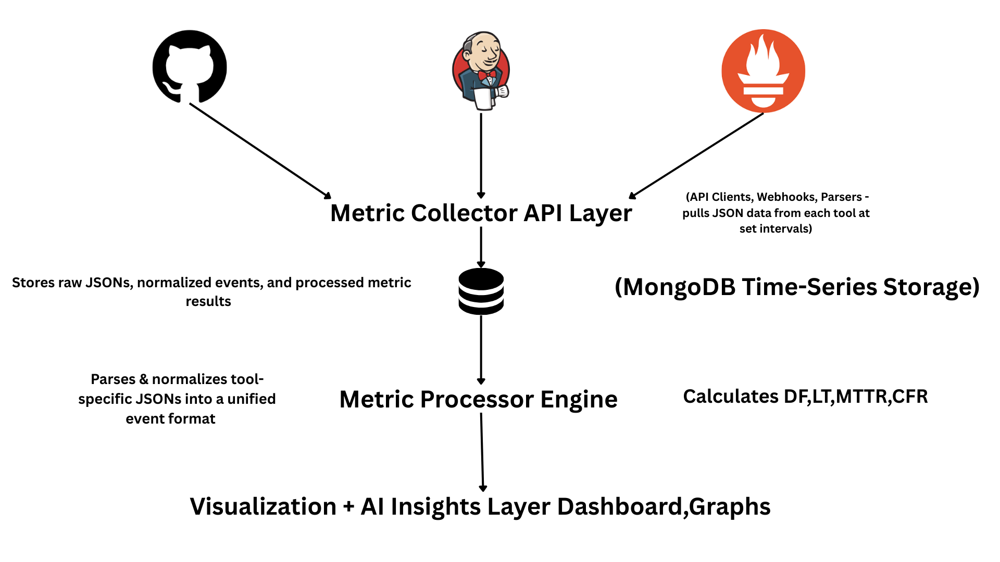

# 📊 AnaMetric – DORA Metrics Analytics Engine

**AnaMetric** is a powerful and extensible DevOps analytics tool designed to automatically collect, process, and visualize the **four key DORA metrics**. It enables engineering teams to measure and improve software delivery performance using data from CI/CD tools and production monitoring systems.

> 🚀 Built for modern DevOps culture • Backed by real-time metrics • Powered by MongoDB Time-Series

---

## 📌 Why AnaMetric?

Modern DevOps teams need visibility into delivery performance. AnaMetric brings clarity through:

- ✅ Automated data collection from GitHub, Jenkins, and Prometheus  
- ✅ Unified event model across tool-specific JSONs  
- ✅ Accurate DORA metric calculation (DF, LT, CFR, MTTR)  
- ✅ Time-series storage for historical trend analysis  
- ✅ Ready for visualization and AI-powered insights  

---

## ⚙️ DORA Metrics Tracked

| Metric                 | Description                                                                 |
|------------------------|-----------------------------------------------------------------------------|
| **Deployment Frequency (DF)** | How often code is successfully deployed to production                 |
| **Lead Time for Changes (LT)** | Time taken from code commit to production deployment               |
| **Change Failure Rate (CFR)** | Percentage of deployments causing failures in production             |
| **Mean Time to Restore (MTTR)** | Average time to recover from a failure in production               |

---

## 🧠 High-Level Architecture

See full architecture: [`docs/architecture.md`](docs/architecture.md)  

---

## 📁 Project Structure

<pre> <code> 📁 AnaMetric/ │ ├── collector/ → Tool-specific collectors (GitHub, Jenkins, Prometheus) ├── processor/ → DORA metric calculation & normalization logic ├── api/ → REST API for metric access ├── database/ → MongoDB schema or seed data (if needed) ├── config/ → Configurations (e.g., API keys, intervals) ├── docs/ → Architecture, design decisions, visuals ├── tests/ → Unit/integration tests ├── requirements.txt → Python dependencies └── README.md → This file </code> </pre>
